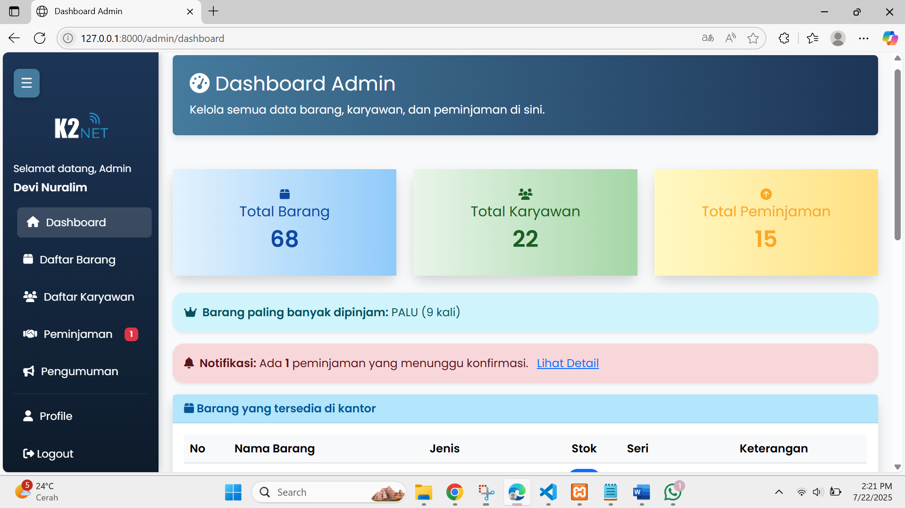
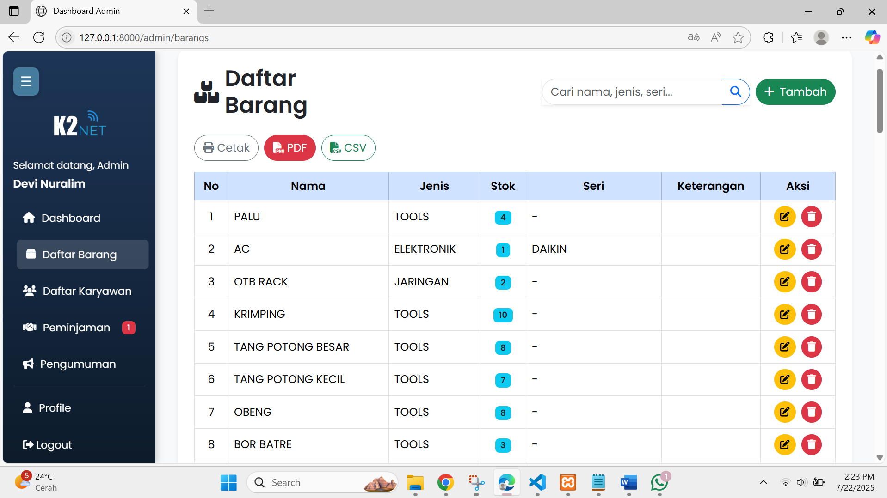
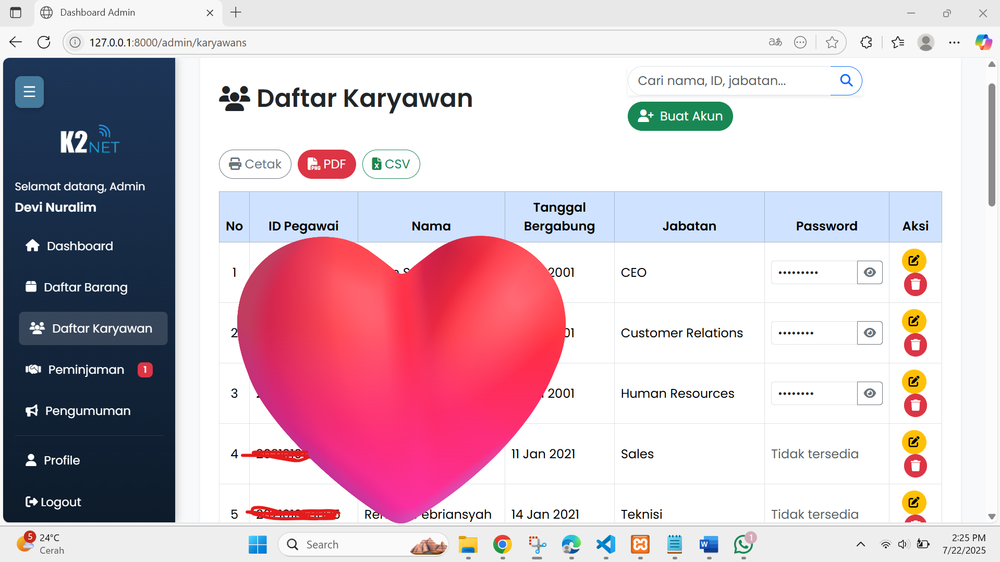
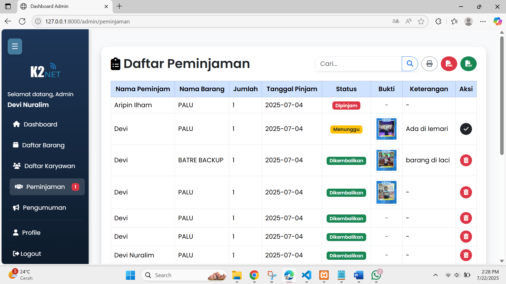
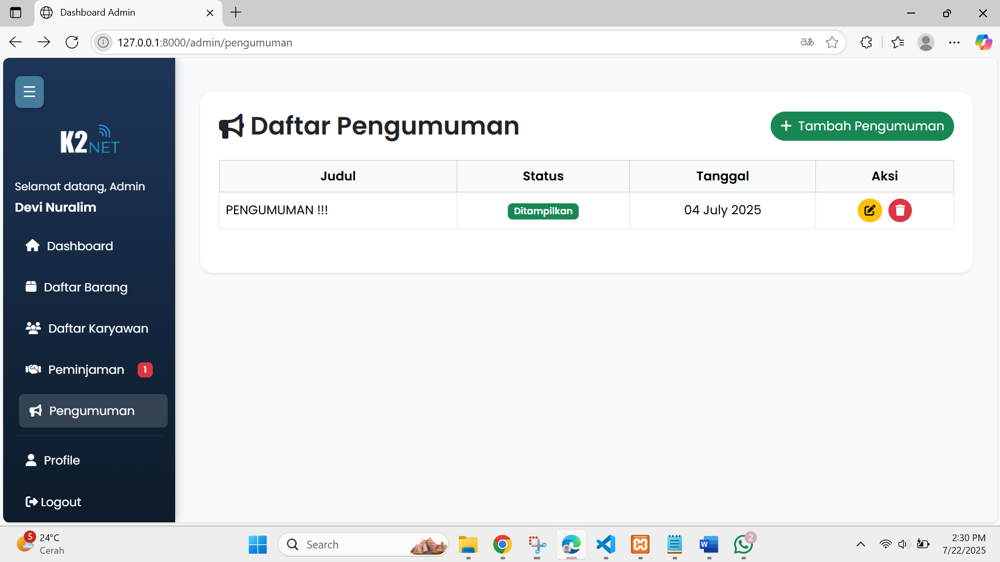
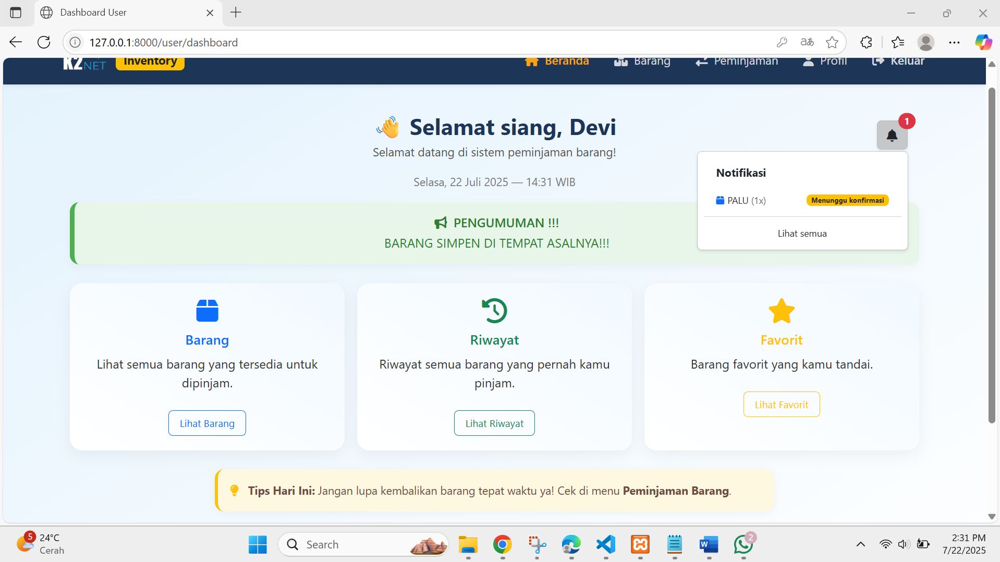
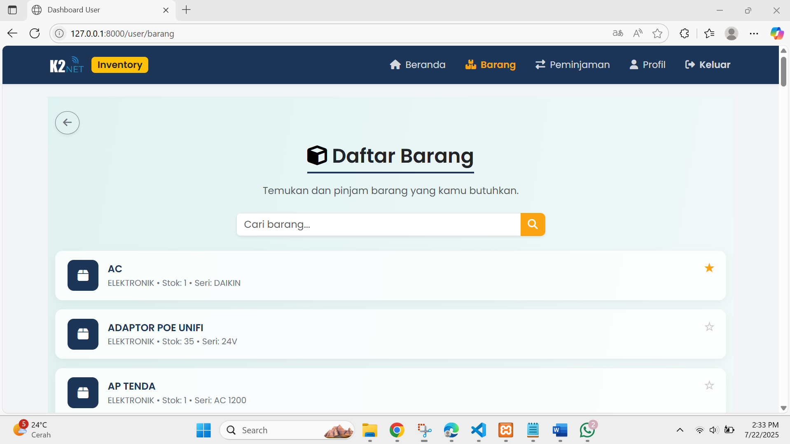
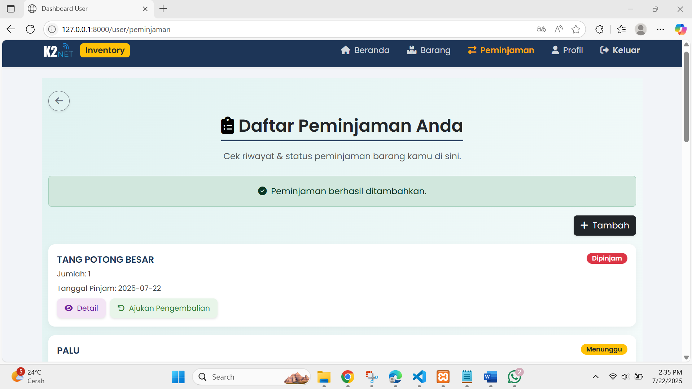
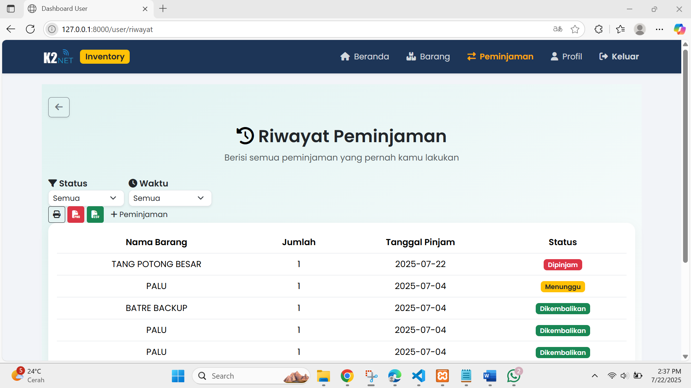

# Inventory Management System

Inventory Management System adalah aplikasi berbasis web yang dikembangkan dengan Laravel untuk membantu pengelolaan data barang di lingkungan kantor. Aplikasi ini memungkinkan admin dan karyawan untuk melakukan pencatatan barang masuk/keluar, pengajuan peminjaman, konfirmasi pengembalian, serta monitoring kondisi stok barang secara real-time.

Sistem ini juga mendukung fitur role-based login (admin & karyawan), notifikasi status peminjaman, riwayat aktivitas, serta ekspor data ke berbagai format seperti PDF dan Excel. Aplikasi ini dirancang agar efisien, mudah digunakan, dan scalable untuk kebutuhan inventarisasi kecil hingga menengah.

## Tujuan Aplikasi

1. Mempermudah pengelolaan barang kantor secara digital
2. Menghindari kehilangan atau ketidakteraturan data barang
3. Menyediakan sistem peminjaman dan pengembalian yang transparan
4. Memberi insight cepat melalui dashboard statistik dan riwayat aktivitas

## Fitur
1. Autentikasi Login (Admin & Karyawan)
2. CRUD Barang
3. Manajemen Karyawan
4. Peminjaman & Pengembalian Barang
5. Dashboard Statistik
6. Notifikasi Peminjaman Menunggu Konfirmasi
7. Ekspor PDF & Excel (Barang & Peminjaman)
8. Print
9. Riwayat Peminjaman Karyawan
10. Pengumuman
11. Barang Favorit

## Teknologi yang Digunakan
- Laravel 12
- PHP 8
- Blade
- Boostrap
- MySQL
- PHPExcel / DomPDF
- Laravel Breeze
- GitHub & Git
- VSCode
- XAMPP
## Run Locally

Clone the project

```bash
  git clone https://github.com/devinuralim/Inventory-Management-System
```

Go to the project directory

```bash
  cd Inventory-Management-System
```

Install dependencies

```bash
  npm install
```

Run Vite

```bash
  npm run dev
```


## Environment Variables

To run this project, you will need to add the following environment variables to your .env file

`DB_CONNECTION=mysql`

`DB_HOST=127.0.0.1`

`DB_PORT=3306`

`DB_DATABASE=db_inventory`

`DB_USERNAME=root`

`DB_PASSWORD=`

💡 Jangan lupa nyalakan XAMPP (Apache & MySQL) dan buat database baru di phpMyAdmin dengan nama db_inventory.

Jalankan Migrasi Database
```bash
  php artisan migrate
```
Jalankan Server
```bash
  php artisan serve
```
## Demo
http://127.0.0.1:8000
## Screenshots
### Admin
1. Dashboard

2. Daftar Barang

3. Daftar karyawan

4. Peminjaman

5. Peminjaman


### User

1. Dashboard

2. Barang

3. Daftar Peminjaman

4. Riwayat Peminjaman

5. Barang Favorit
